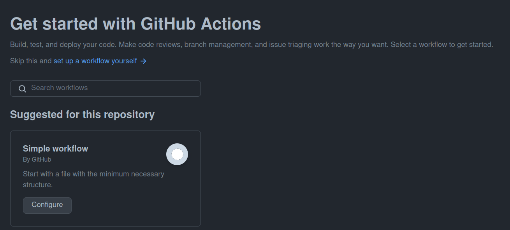

# Github Actions Katas

This series of katas will go through the basic steps in github actions, making you able to make CI builds in the end.

## Learning Goals

- Creating an instance of the template repository
- Creating a workflow file

## Building a CI pipeline in GitHub Actions

In this workshop we will be using a small java service which uses Gradle to build the application.

The application is found in the `app` directory, though the details of the implementation are not interesting for the purposes of these katas.
There are a number of shell scripts that help with building the application, these are located in the `ci` directory.

The purpose of these katas is to use the small java application to exemplify how to use Github Actions to build, test and package your applications.

We ultimately want a pipeline that has the following jobs:

- **Clone down:** makes the git clone, and prepares the repo for being distributed to the parallel steps
- **Test:** runs the gradle test command found in [ci/unit-test-app.sh](../ci/unit-test-app.sh)
- **Build:** runs the gradle build command found in [ci/build-app.sh](../ci/build-app.sh)
- **Build docker:** runs both [building of the docker image](../ci/build-docker.sh), and [pushes it up to the hub](../ci/push-docker.sh)
- **Component test:** runs a [docker-compose file](../component-test/docker-compose.yml) with a [python test](../component-test/test_app.py) to test the application.
- **Performance test:** runs a [docker-compose file](../performance-test/docker-compose.yml) with a [k6 performance tester](../performance-test/single-request.js) to test the application.

We are not going to do it all in one go, but rather step by step.
## Exercise

### Overview

In this exercise we are creating your own instance of this templated repository, and creating a workflow file called `.github/workflows/hello-world.yml`.

<details>
<summary>:bulb: This requires git email and name to bee configured on your machine. If you have not done this, here are the commands to set it up</summary>

You need to provide your email and name to git with the following commands.

``` bash
git config --global user.email "you@example.com"
git config --global user.name "Your Name"
```

</details>

### Tasks

#### Creating a repository

-  Go to Code tab of this repository and click `Use this template`


-  Select your GitHub user as the owner and name the repository. Leave the repo public to have unlimited action minutes.

> :bulb: **From now on _only_ use the your own repository.**

#### Creating the workflow

All your workflow files will be located in the `.github/workflows` folder.

- Click on the `Actions` tab and click `New workflow`

- Click on the "setup the workflow yourself" link



- The file should look like this:

``` yaml
# This is a basic workflow to help you get started with Actions

name: CI

# Controls when the workflow will run
on:
  # Triggers the workflow on push or pull request events but only for the "main" branch
  push:
    branches: [ "main" ]
  pull_request:
    branches: [ "main" ]

  # Allows you to run this workflow manually from the Actions tab
  workflow_dispatch:

# A workflow run is made up of one or more jobs that can run sequentially or in parallel
jobs:
  # This workflow contains a single job called "build"
  build:
    # The type of runner that the job will run on
    runs-on: ubuntu-latest

    # Steps represent a sequence of tasks that will be executed as part of the job
    steps:
      # Checks-out your repository under $GITHUB_WORKSPACE, so your job can access it
      - uses: actions/checkout@v3

      # Runs a single command using the runners shell
      - name: Run a one-line script
        run: echo Hello, world!

      # Runs a set of commands using the runners shell
      - name: Run a multi-line script
        run: |
          echo Add other actions to build,
          echo test, and deploy your project.
```

- click `Commit changes` and commit to the main branch
- Go to the `Actions` tab and see the workflow running
- Click on the workflow and see the output of the workflow

## Summary

Congratulations! You have now created your first workflow!
It does not do much, but in the next exercise we will start building on it.

